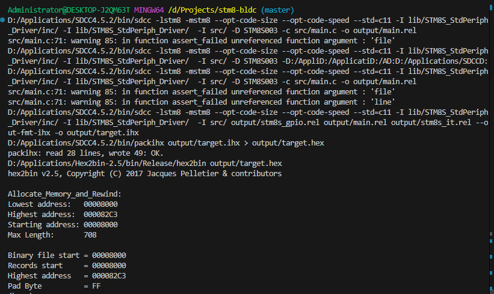
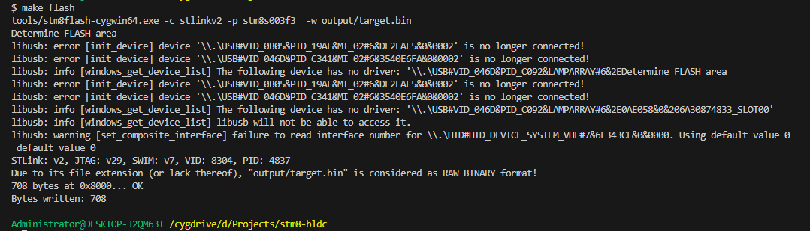
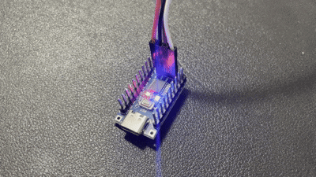

# STM8-MAKEFILE-PROJECT-TEMPLATE

## structure

```bash
$ tree ./
./
├── doc
├── tools
├── lib
│   └── STM8S_StdPeriph_Driver
│       ├── inc
│       ├── src
│       ├── stm8s_conf.h
│       └── Makefile
├── output
│   ├── target.bin
│   └── target.hex
├── src
│   ├── main.c
│   ├── stm8s_it.c
│   ├── stm8s_it.h
│   └── Makefile
├── Makefile
└── README.md

8 directories, 83 files
```

## build



## program



## flash led

